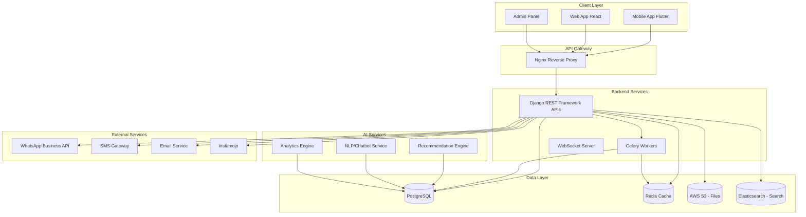
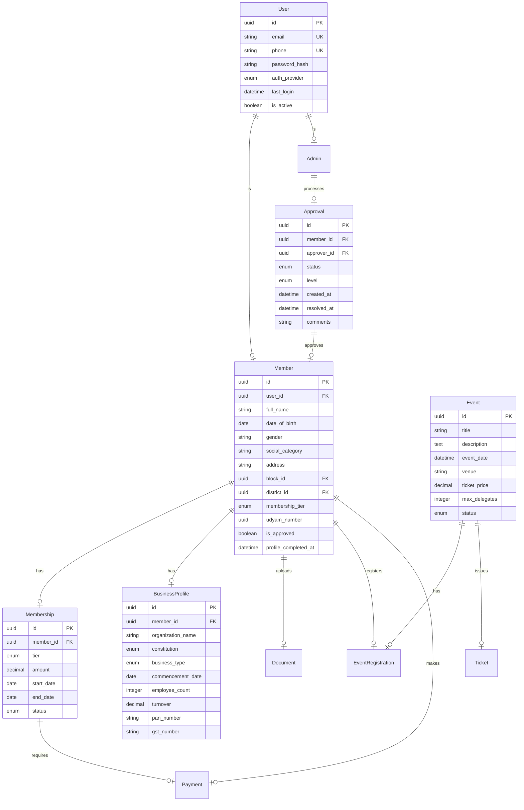

# ACTIV Membership Portal - Project Plan

## Executive Summary
Develop a comprehensive Membership Registration and Management System for ACTIV (Adidravidar Confederation of Trade and Industrial Vision) with Web and Mobile App interfaces. The system will support multi-level membership, multi-tier admin hierarchy, event management, and AI-powered features.

## Tech Stack Recommendation

### Backend
- **Framework:** Django 5.x with Django REST Framework
- **Language:** Python 3.11+
- **Database:** PostgreSQL 15+
- **Caching:** Redis
- **Task Queue:** Celery with Redis Broker
- **API Documentation:** drf-yasg (Swagger)

### Frontend (Web)
- **Framework:** React 18 with TypeScript
- **UI Library:** Material-UI (MUI) or Ant Design
- **State Management:** Redux Toolkit or React Query
- **Authentication:** JWT Tokens

### Mobile App
- **Framework:** Flutter 3.x (Dart)
- **Platforms:** Android & iOS
- **State Management:** Provider or Riverpod

### AI/ML Stack
- **ML Framework:** TensorFlow 2.x / PyTorch
- **Data Processing:** Pandas, NumPy
- **Recommendations:** Scikit-learn for collaborative filtering
- **NLP:** spaCy or Hugging Face Transformers (for chatbot)

### DevOps & Infrastructure
- **Cloud:** AWS (as per client preference)
- **Containerization:** Docker & Docker Compose
- **CI/CD:** GitHub Actions or GitLab CI
- **Monitoring:** Sentry, CloudWatch

---

## System Architecture



---

## User Roles & Permissions

| Role | Permissions |
|------|-------------|
| **Public** | View public content, register, browse events |
| **Member** | Complete profile, apply for membership, view members, book events, make payments |
| **Block Admin** | Verify/approve members in block, manage block events |
| **District Admin** | Approve block admins, monitor all blocks in district, approve district members |
| **State Admin** | Nominate district/block admins, monitor state, approve state-level members |
| **Super Admin** | Full system access, nominate all admins, pan-India monitoring |

---

## Feature Modules

### 1. Authentication & Profiles
- [ ] Social Login (Google, Facebook, LinkedIn)
- [ ] Email/Phone OTP verification
- [ ] JWT-based authentication
- [ ] Profile management (all fields editable)
- [ ] Profile completion tracking
- [ ] Profile visibility settings

### 2. Member Registration & Udyam Validation
- [ ] Multi-step registration form
- [ ] Document upload (Aadhaar, PAN, Business docs)
- [ ] Udyam Registration optional
- [ ] Manual Udyam verification workflow
- [ ] Business profile management
- [ ] Sister concerns tracking

### 3. Multi-Level Membership
- [ ] Membership Tiers:
  - Learner (Free)
  - Beginner (Annual)
  - Intermediate (Annual)
  - Ideal (Lifetime)
- [ ] Membership fee management
- [ ] Certificate generation (PDF)
- [ ] Receipt generation

### 4. Approval Workflow
- [ ] Block → District → State approval chain
- [ ] Auto-assignment to block admin
- [ ] Escalation after 1 day inactivity
- [ ] Automated reminders
- [ ] Notification center (In-app, Email, SMS, WhatsApp)

### 5. Payment Integration
- [ ] Instamojo integration
- [ ] One-time payments (event tickets)
- [ ] Subscription payments (yearly/lifetime)
- [ ] Donation handling
- [ ] Auto-receipt generation
- [ ] Payment history

### 6. Event Management
- [ ] Create/manage events (Admin)
- [ ] Event registration with delegate management
- [ ] Ticket booking with QR code
- [ ] Event notifications (push, SMS, WhatsApp)
- [ ] Event analytics

### 7. Notifications System
- [ ] Email (SendGrid/AWS SES)
- [ ] SMS (Twilio/local provider)
- [ ] Push notifications (Firebase Cloud Messaging)
- [ ] WhatsApp Business API integration
- [ ] Template-based messaging
- [ ] Notification history

### 8. Admin Dashboard
- [ ] Role-specific dashboards
- [ ] Key metrics:
  - Total members
  - Pending approvals
  - Revenue analytics
  - Event participation
- [ ] Advanced filters (Area, Gender, Membership type)
- [ ] Export reports (PDF, Excel)

### 9. Member Directory & Networking
- [ ] Searchable member directory
- [ ] Filter by: Location, Business Type, Membership tier
- [ ] Member profiles visibility
- [ ] Direct messaging (optional)

---

## AI/ML Features

### 1. Smart Member Recommendation Engine
- **Purpose:** Connect members with similar business profiles
- **Algorithm:** Collaborative Filtering + Content-based
- **Features:**
  - Recommend potential business partners
  - Suggest relevant events
  - Member clustering by industry/location

### 2. Intelligent Search
- **Purpose:** Enhanced search experience
- **Features:**
  - Semantic search using embeddings
  - Auto-suggestions
  - Spelling correction
  - Filter recommendations

### 3. Business Matching Algorithm
- **Purpose:** B2B networking optimization
- **Features:**
  - Match buyers with suppliers
  - Suggest potential collaborators
  - Supply-demand gap analysis

### 4. Analytics Dashboard with Insights
- **Purpose:** Data-driven decisions
- **Features:**
  - Membership trend prediction
  - Churn analysis
  - Geographic distribution heatmaps
  - Revenue forecasting

### 5. Chatbot for Member Support
- **Purpose:** 24/7 member assistance
- **Features:**
  - Answer FAQs
  - Membership status查询
  - Event information
  - Escalate to human support

### 6. Document Verification Automation
- **Purpose:** Speed up membership approval
- **Features:**
  - Auto-extract data from uploaded documents
  - Validate PAN/GST/Udyam numbers
  - Flag suspicious applications

---

## Database Schema (Key Models)



---

## Development Phases

### Phase 1: Foundation (Weeks 1-3)
- [ ] Set up development environment
- [ ] Design database schema
- [ ] Implement user authentication
- [ ] Social login integration
- [ ] Basic user profile management
- [ ] CI/CD pipeline setup

### Phase 2: Core Features (Weeks 4-7)
- [ ] Member registration flow
- [ ] Multi-step form with validation
- [ ] Document upload system
- [ ] Business profile management
- [ ] Admin panel basics
- [ ] Role-based access control

### Phase 3: Workflow Engine (Weeks 8-10)
- [ ] Multi-level approval workflow
- [ ] Auto-escalation system
- [ ] Notification center
- [ ] Email/SMS integration
- [ ] WhatsApp API integration
- [ ] Notification templates

### Phase 4: Payments & Events (Weeks 11-13)
- [ ] Instamojo integration
- [ ] Membership fee management
- [ ] Event creation/management
- [ ] Ticket booking system
- [ ] QR code generation
- [ ] Receipt generation

### Phase 5: Mobile App (Weeks 14-17)
- [ ] Flutter app setup
- [ ] Authentication flows
- [ ] Member dashboard
- [ ] Event browsing & registration
- [ ] Push notifications
- [ ] Profile management

### Phase 6: AI/ML Integration (Weeks 18-20)
- [ ] Recommendation engine setup
- [ ] Member clustering algorithm
- [ ] Smart search implementation
- [ ] Analytics dashboard
- [ ] Chatbot development

### Phase 7: Testing & Deployment (Weeks 21-22)
- [ ] Unit testing
- [ ] Integration testing
- [ ] Security audit
- [ ] Performance optimization
- [ ] AWS deployment
- [ ] UAT with client

### Phase 8: Launch & Documentation (Week 23)
- [ ] Bug fixes
- [ ] User training
- [ ] Documentation
- [ ] Go-live
- [ ] Post-launch support

---

## API Endpoints Structure

### Authentication
```
POST   /api/v1/auth/register/
POST   /api/v1/auth/login/
POST   /api/v1/auth/social/login/
POST   /api/v1/auth/refresh-token/
POST   /api/v1/auth/forgot-password/
```

### Members
```
GET    /api/v1/members/
POST   /api/v1/members/
GET    /api/v1/members/{id}/
PUT    /api/v1/members/{id}/
GET    /api/v1/members/profile/
PUT    /api/v1/members/profile/
POST   /api/v1/members/{id}/documents/
```

### Membership
```
GET    /api/v1/memberships/
POST   /api/v1/memberships/apply/
GET    /api/v1/memberships/{id}/
GET    /api/v1/memberships/tiers/
GET    /api/v1/memberships/certificate/{id}/
```

### Approvals
```
GET    /api/v1/approvals/pending/
POST   /api/v1/approvals/{id}/approve/
POST   /api/v1/approvals/{id}/reject/
GET    /api/v1/approvals/history/
```

### Events
```
GET    /api/v1/events/
POST   /api/v1/events/
GET    /api/v1/events/{id}/
POST   /api/v1/events/{id}/register/
GET    /api/v1/events/{id}/ticket/
```

### Payments
```
POST   /api/v1/payments/initiate/
POST   /api/v1/payments/webhook/
GET    /api/v1/payments/history/
GET    /api/v1/payments/receipt/{id}/
```

### Admin
```
GET    /api/v1/admin/dashboard/stats/
GET    /api/v1/admin/members/
PUT    /api/v1/admin/members/{id}/
GET    /api/v1/admin/approvals/
POST   /api/v1/admin/escalations/
```

### AI Features
```
GET    /api/v1/ai/recommendations/
GET    /api/v1/ai/members/similar/{id}/
GET    /api/v1/ai/search/
GET    /api/v1/ai/analytics/insights/
POST   /api/v1/ai/chatbot/
```

---

## Security Considerations

1. **Authentication:** JWT with refresh tokens, rate limiting
2. **Authorization:** Role-based access control (RBAC)
3. **Data Encryption:** AES-256 for sensitive data, TLS 1.3
4. **Input Validation:** Schema validation, SQL injection prevention
5. **File Security:** Malware scanning for uploads, secure file storage
6. **API Security:** API throttling, CORS configuration
7. **Compliance:** GDPR-ready, DPDP Act compliant
8. **Audit Logging:** All admin actions logged

---

## Third-Party Services

| Service | Purpose | Estimated Cost |
|---------|---------|----------------|
| AWS EC2/RDS/S3 | Hosting | ₹15,000-25,000/month |
| WhatsApp Business API | Messaging | ₹0.50-1.00/message |
| SMS Gateway | Notifications | ₹0.20-0.50/SMS |
| SendGrid/AWS SES | Email | ₹0.10-0.30/email |
| Instamojo | Payments | 2% + ₹3/transaction |
| Firebase Cloud Messaging | Push notifications | Free (up to limit) |
| Twilio (Alternative SMS) | SMS | ₹0.40-0.60/SMS |

---

## Next Steps

1. **Approve this plan** - Review and confirm the architecture and features
2. **Sign off on tech stack** - Confirm Django + Flutter is acceptable
3. **Gather additional requirements** - Finalize specific AI features to implement
4. **Begin Phase 1** - Set up development environment and database design
5. **Schedule regular sync-ups** - Bi-weekly progress reviews

---

*Plan Version: 1.0*
*Created: January 8, 2026*
*Last Updated: January 8, 2026*
